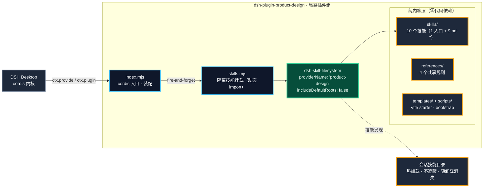

# 架构设计

> 本文面向要改插件源码、接宿主契约或维护本仓库的人。普通使用请看 [README](../README.zh-CN.md) 的快速开始。

## 为什么是纯技能插件

DSH 宿主把"产品想法 → 可评审原型"所需的一切执行能力都交给了模型与会话工具链（shell、浏览器、图像生成、本地 dev server）——插件层**没有可注册的模型工具、没有客户端模块**，唯一能做且该做的事是把方法论变成技能。纯技能形态意味着：

- **零宿主改动**：cordis 插件组隔离挂载（`cordis.patch.yml` 的 `isolate: productDesign`），一个故障不会拖垮宿主；
- **随装随卸**：`install.ps1` / `-Uninstall` 对称，卸载后不留技能、不留状态；
- **技能面即合约**：10 个技能全部经隔离 `dsh-skill-filesystem` provider 发现，模型面与宿主包解耦；
- 与 [dsh-plugin-task-coordinator](https://github.com/Kayungko/dsh-plugin-task-coordinator) 同源挂载模式——那边是「六工具 + 一个 supervisor 技能」，这边是「零工具 + 十个技能」，隔离 provider 的先例与降级策略完全一致。

## 挂载拓扑

> 图注：`skills/`、`references/`、`templates/`、`scripts/` 是纯内容目录——没有任何运行时代码依赖，技能正文以 `$` 引用互相路由，共享规则被技能按需加载。

分层约束：

- **`index.mjs`**：唯一装配层。`apply(ctx, input)` 只做两件事——`ctx.provide('productDesign', { version, enabled })` 与 fire-and-forget 调用 `mountProductDesignSkills(ctx)`；`enabled: false` 时只 provide 不挂载；
- **`skills.mjs`**：对 `@deepseek-ai/dsh-skill-filesystem` 用**动态 import**，provider 配置三件套 `providerName: 'product-design'`（永不与 DSH 的 `filesystem` 冲突）/ `includeDefaultRoots: false` / `customSkillDirs: [skills/]`（只见本包技能）；
- **纯内容层**：技能与规则是 Markdown + 随附脚本（`skills/user-context/scripts/` 的 Node 脚本经 `npm run check` 语法覆盖），不参与 cordis 装配。

## 降级策略

技能是伴侣，不是契约——`mountProductDesignSkills` 是 fire-and-forget：

1. `@deepseek-ai/dsh-skill-filesystem` 动态 import 失败 → 降级为一条 warning，bundle 照常 provide；
2. `ctx.plugin(...)` 挂载失败 → 同样只打 warning；
3. `enabled: false` → 记录 info 后直接返回，不挂载。

装配顺序即优先级：先 `ctx.provide`（描述符必然存在），后技能挂载（可降级）。宿主没有 skill-filesystem 包时，插件**安静地变成无技能状态**，而不是把整个 bundle 拖崩。

## 路由拓扑（技能面）

用户只看见 `/product-design`。入口技能加载后分析需求并路由到 9 个 `pd-*` 子技能（`user-invocable: false`，模型可见、命令列表隐藏）；子技能正文以 `$product-design` 反向引用路由。闸门类技能（`pd-get-context` / `pd-design-qa`）是工作流契约的执行点，详见 [PROTOCOL.md §3](PROTOCOL.md)。

## 相关文档

- [PROTOCOL.md](PROTOCOL.md) — 工作流闸门与主机契约实测参考（注入面、技能挂载契约、能力边界、验证记录）
- [../skills/](../skills/) — 10 个技能正文（模型实际读的就是它们）
- [CHANGELOG](../CHANGELOG.md) — 版本更新日志
